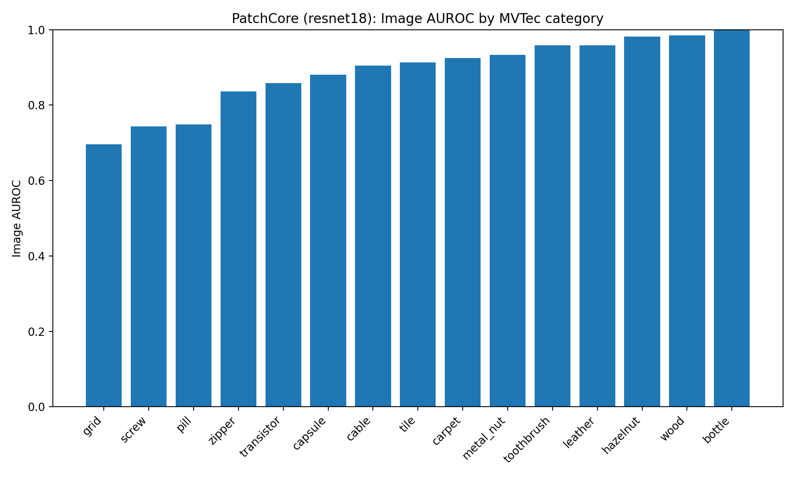
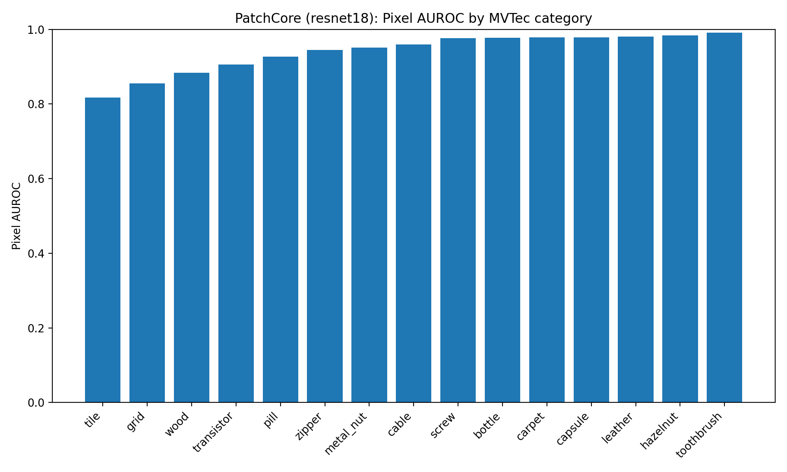
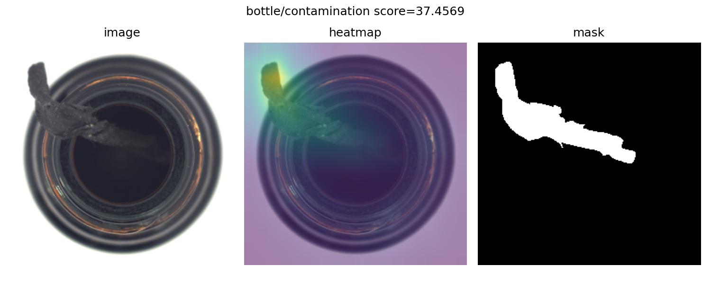
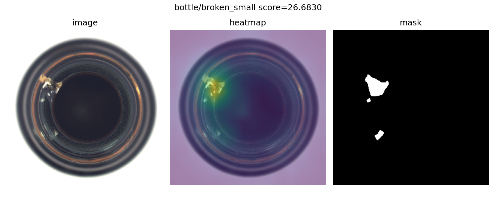

# Metrology Inspection + Uncertainty (PatchCore on MVTec AD)

A small, reproducible pipeline for industrial surface anomaly detection using a PatchCore-style baseline.
It provides a simple CLI to download MVTec AD, train per-category models, evaluate image/pixel localization,
and export metrics + qualitative galleries.

## Quickstart (single category)

From PowerShell in the repo root:

```powershell
# 0) Create + activate venv (if needed)
python -m venv .venv
.\.venv\Scripts\Activate.ps1
pip install -e ".[dev]"

# 1) Download dataset (path is configured in configs/default.yaml)
metinspect download

# 2) Train a PatchCore baseline for one category (set category in configs/default.yaml)
metinspect train --backbone resnet18

# 3) Evaluate + save a qualitative gallery
metinspect eval --backbone resnet18 --gallery-n 12

### Plots





### Qualitative examples (bottle)




